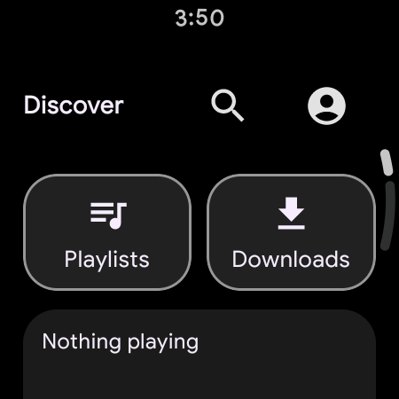
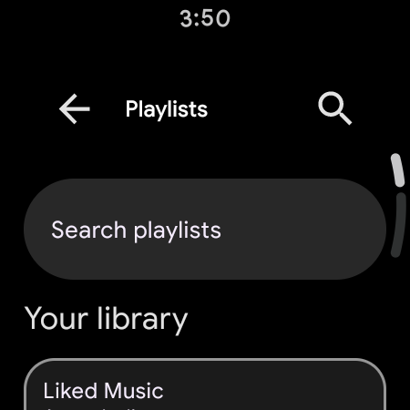
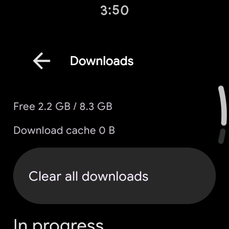
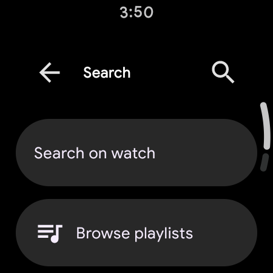

# SimpMusic-WearOS

WearOS-focused fork of SimpMusic, with standalone watch playback and a Wear-native UI built with Wear Compose Material 3.

## What This Repo Is
- A fork specialized for WearOS development.
- Not a mirror of upstream app priorities.
- Optimized for real on-watch usage (Galaxy Watch class devices), including standalone Wi-Fi playback.

## Current Wear Status
- Dedicated `wearApp` module.
- Wear screens: Discover, Home, Library, Playlist (local + YouTube), Song Details, Now Playing, Queue, Accounts, Login, Downloads, Search filters, online playlists.
- Phone-assisted login bridge is implemented for devices where watch-side WebView is unavailable/unreliable.
- Playback pipeline has Wear-specific reliability hardening, resolver fallback tuning, and watch battery-aware stream selection.
- Tested on: Galaxy Watch4 Classic, WearOS 5

## Recent Progress (Feb 2026)
- Immersive player + drag sheet: Controls/Lyrics/Queue tabs, scrollable expanded sheet, queue reordering/removal, and centered karaoke-style synced lyrics.
- Lyrics upgrades: translation modes (`Original` / `Translated` / `Both`), tap-to-seek lines, and offline lyrics pinning for downloaded tracks.
- Search + library parity: category filters (songs/playlists/artists/podcasts), deeper liked/recent/followed flows, and improved library state retention.
- Tile + complication support: dynamic playback tile, actionable controls (prev/play-next), playback-aware complication actions.
- Phone companion upgrades: selective sync, diagnostics/log export, remote controls, bidirectional queue handoff (phone↔watch), and background auto-sync worker.
- Performance + battery pass: wearable battery saver mode, phone offload controls with watch-only override, delta sync signatures/stats, and charging/Wi-Fi-aware auto-sync policies.

## Wear Feature Highlights
- **Immersive playback UX**: compact round-screen controls, marquee title, progress ring, queue/lyrics in the same sheet.
- **Companion bridge**: watch can control phone playback, and handoff waits for explicit ack before success/pause behavior.
- **Battery-aware operation**: reduced heavy visual work in battery saver, plus conservative watch stream probing and auto-sync policy gates.

## Fresh Watch Screenshots
| Discover | Playlists |
| --- | --- |
|  |  |

| Downloads | Search |
| --- | --- |
|  |  |

## Architecture Notes
- Reuses shared core/data/media/service modules from the original app where practical.
- Adds Wear-specific app shell, navigation, auth bridge, network binding, and UX flows.
- Uses Wear Compose Material 3 components (not phone-style UI).

## Build

### Debug APK (Watch)
```bash
./gradlew_ws :wearApp:assembleDebug
```

APK output:
```text
wearApp/build/outputs/apk/debug/wearApp-debug.apk
```

### Install on Watch
```bash
adb devices -l
adb -s <watch-adb-id> install -r -t wearApp/build/outputs/apk/debug/wearApp-debug.apk
```

Optional reset app data:
```bash
adb -s <watch-adb-id> shell pm clear com.maxrave.simpmusic.dev
```

## Login on Wear
- Watch login can be initiated from the Wear app.
- Phone handles the Web-based account flow.
- Session/cookie is returned to the watch through Wear Data Layer.

## Known Constraints
- YouTube backend behavior changes over time and can break stream extraction paths.
- WearOS networking is less stable than phone networking (Bluetooth proxy, Wi-Fi handoffs, radio wakeups).
- Some heavy phone features are still being ported/tuned for watch hardware limits.

## Roadmap
- Path A: UI/UX stabilization and polish.
- Path B: feature parity pass (search, richer queue actions, improved startup session handling).
- Path C: larger standalone features (downloads/offline, deeper library workflows).

## Upstream
- Upstream project: `maxrave-dev/SimpMusic`
- This fork intentionally diverges in implementation details and priorities for WearOS.
